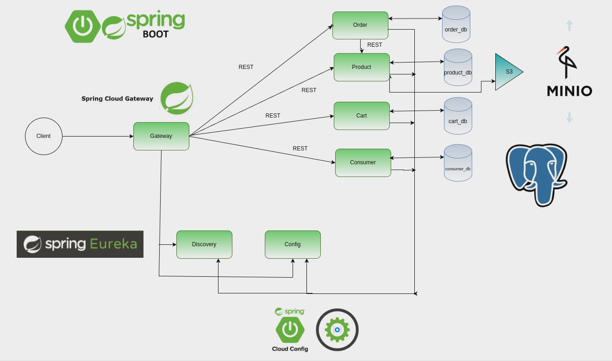

# Marketplace_k8s

> **Проект с хакатона мигрированный в Kubernetes**  
> *Сервис управления товарами, разбитый на набор Spring Boot микросервисов и фронтендом на React. Все мигрировано в
Kubernetes.*

## Содержание

1. [Общая информация](#общая-информация)
2. [Технологический стек](#технологический-стек)
3. [Архитектура](#архитектура)
4. [Микросервисы](#микросервисы)
5. [Frontend](#frontend)
6. [PostgreSQL & MinIO](#postgresql--minio)
7. [Инструкции по запуску (Minikube)](#инструкции-по-запуску-minikube)
8. [Полезные команды для отладки](#полезные-команды-для-отладки)
9. [Дальнейшие планы](#дальнейшие-планы)
10. [Контакты](#контакты)

---

## Общая информация

### Техническое задание

Разработать сервис управления физическими товарами для клуба ИТ-специалистов. Система должна обеспечивать полный цикл
работы с товарами – от регистрации и редактирования характеристик (описание, стоимость) до архивирования и удаления.
Реализовать функционал для учёта товаров на складе (контроль количества в разных статусах, корректировка запасов,
проверка наличия) и формирования заказов (просмотр каталога, добавление/изменение/удаление товаров в корзине, оформление
заказа). Кроме того, предусмотреть управление заказами с возможностью поиска по номеру, дате, заказчику и изменением
статусов заказа.

Разработать ролевую модель, включающую три типа пользователей: Администратор (управление пользователями, правами
доступа, каталогом товаров и заказами), Менеджер (управление товарами и заказами) и Пользователь (просмотр каталога,
формирование корзины, оформление заказов). После реализации всех модулей провести тестирование, чтобы подтвердить
корректную работу всех функциональных возможностей системы.

### Итоговое решение

В рамках хакатона наша команда разработала проект, состоящий из нескольких микросервисов на Spring Boot и фронтенда на
React. Во время хакатона был реализован запуск через Docker Compose. После я перенёс приложение в **Kubernetes** для
изучения DevOps-практик.

### Команда

В команде было 6 участников:

- **Прикладной администратор**: Я (контейнеризация, развертывание, помощь с проектированием и git конфликтами)
- **Java-разработчик**: [Егор](https://github.com/Egor-works) (разработка Java Spring микросервисов)
- **Frontend-разработчики**: [Артём](https://github.com/knight-artemis), [Давид](https://github.com/terriblygood) (
  React)
- **Ручной тестировщик**: Алёна (тестирование, написание тест-кейсов)
- **Бизнес-аналитик**: Ксюша (анализ требований)

> В рамках хакатона у меня было 2 команды. Я решил мигрировать в Kubernetes именно этот проект, так как в нем
> реализованы
> очень тяжеловестные микросервисы и S3 хранилище. Для меня первичным в выборе была сложность и комплексность проекта, а
> не красота и завершенность)

---

## Технологический стек

- **Kubernetes** (Deployments, StatefulSets, Services, Secrets и т.д.)
- **Docker** (2х этапная сборка, Docker Compose, локальный registry)
- **Java Spring Boot** (микросервисы: cart-service, config-service, consumer-service, discovery-service,
  gateway-service, order-service, product-service)
- **React** (Frontend)
- **PostgreSQL** (хранение данных)
- **MinIO** (локальное S3-хранилище)

---

## Архитектура

1. **Discovery-Service (Eureka)** — сервис регистрации и обнаружения микросервисов.
2. **Config-Service** — управление конфигурациями для всех микросервисов.
3. **Gateway-Service** — единая точка входа для внешних запросов (API Gateway).
4. **Cart-Service** — управление корзиной.
5. **Order-Service** — управление заказами.
6. **Product-Service** — управление товарами.
7. **Consumer-Service** — управление пользователями.
8. **PostgreSQL** (StatefulSet) — основная БД.
9. **MinIO** (StatefulSet) — S3-хранилище.
10. **Frontend (React)** — пользовательский интерфейс.



---

## Backend

Микросервисы запускаются в Kubernetes в виде **Deployment**. Для упрощения поддержки в рамках хакатона, все jar файлы
содержатся в одном образе.

- Gateway-Service использует LoadBalancer, остальные сервисы — ClusterIP.
- Каждый Pod содержит initContainer для ожидания готовности других сервисов.
- Конфигурация задается через переменные env, секреты хранятся в Kubernetes Secrets.
- Каждый Pod имеет requests и limits.
- Каждый Pod имеет livenessProbe и readinessProbe.

---

## PostgreSQL & MinIO

### PostgreSQL (StatefulSet)

Используется **PostgreSQL** в виде StatefulSet, чтобы сохранять данные в **PersistentVolumeClaim**.

- Секрет **postgres-secret** хранит логин, пароль и URL базы данных.
- StatefulSet фиксирует порядок запуска и завершения Pod.

### MinIO (S3-хранилище)

**MinIO** используется в качестве локального аналога S3.

- Развёрнут в Kubernetes StatefulSet.
- Применяется для хранения карточек товара.
- Доступна MinIO-консоль для первичной настройки.
- Секрет **minio-secret** хранит логин, пароль и URL хранилища.

---

## Оптимизация контейнеров

### Backend

Для оптимизации контейнеров были применены следующие подходы:

- Использование оптимизированного дистрибутива JDK eclipse-temurin, что позволило сократить использование ОЗУ.
- Использование 2х этапной сборки для уменьшения размера образа и поверхности атаки.
- Использование minimal версии базового образа на втором этапе.
- Оптимизация параметров запуска JAR файлов.

### Frontend

Для оптимизации контейнера фронтенда были применены следующие подходы:

- Использование 2х этапной сборки для уменьшения размера образа и поверхности атаки.
- На втором этапе используется alpine версия Nginx.

---

## Используемые команды для отладки

Ниже — некоторые команды, которые использовал во время отладки и тестирования:

1. **Проброс порта Postgres** на локальную машину:
   ```bash
   kubectl port-forward svc/postgresql 5432:5432
   ```
   После этого можно подключаться к БД как к локальному `localhost:5432`. Пароль не нужен, так как подключение считается
   как с локальной машины.


2. **Проброс порта MinIO-консоли**:
   ```bash
   kubectl port-forward svc/minio 9001:9001
   ```
   Откроется доступ к веб-интерфейсу MinIO на `http://localhost:9001`.


3. **Быстрый тест с помощью `curl`**:
   ```bash
   kubectl run curl-test --image=curlimages/curl -i --tty --rm -- /bin/sh
   ```
   > Команда создаёт pod с `curl`-ом, сразу открывает внутри него консоль. Можно проверять доступ к сервисам по internal
   DNS, например:
   > ```
   > curl http://cart-service:8082/carts/ping
   > ```


4. **Внутренние адреса StatefulSet**:
   ```
   minio-0.minio.default.svc.cluster.local:9000
   postgresql-0.postgresql.default.svc.cluster.local:5432
   ```

5. **Отладка Pod`а через BusyBox**:
   ```bash
   kubectl debug -it <pod-name> --image=busybox
   ```
   > Позволяет «зайти» внутрь Pod с помощью отладочного контейнера.


6. **Мониторинг ресурсов** (CPU, память и т.п.):
   ```bash
   watch kubectl top pod -n default
   ```
   > Команда `watch` будет обновлять вывод в реальном времени.

---


